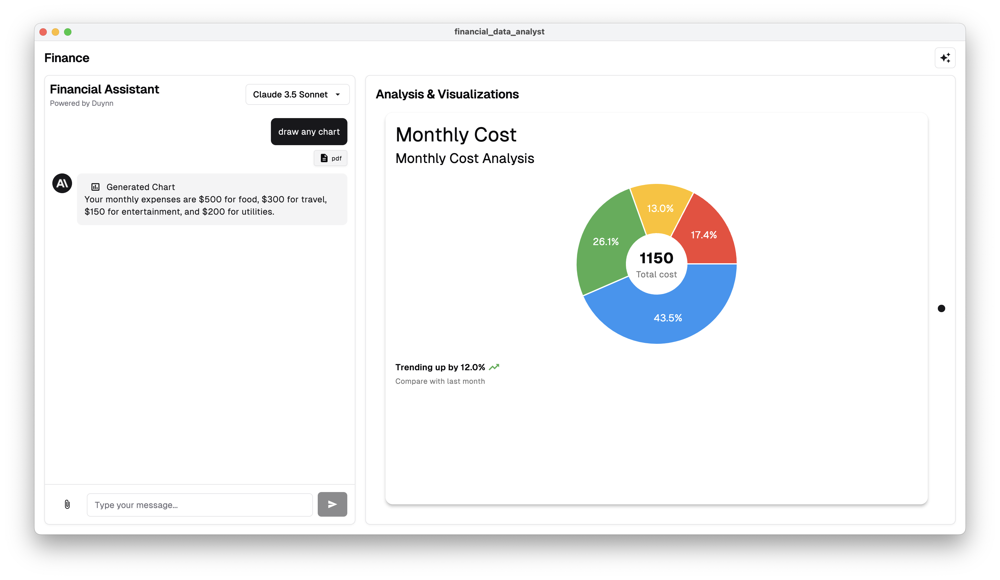

# 📊 financial_data_analyst

A powerful and interactive Flutter-based application for financial data visualization. With support for multiple chart types, natural language interaction, and file uploads, this app helps users turn raw financial data into rich insights—visually and intuitively.



---

## ✨ Features

- Upload CSV, PDF, or image files and extract financial data
- Chat with an AI-powered assistant to ask questions about your data
- Automatic chart generation from natural language prompts
- Supports multiple chart types:
  - Line
  - Bar
  - Multi-Bar
  - Area
  - Stacked Area
  - Pie
- Trend analysis and footer annotations
- Interactive chart tooltips and dynamic visuals

---

## 🛠 Project Requirements

- Flutter SDK (>=3.0.0)
- Dart SDK
- [Solidart](https://pub.dev/packages/flutter_solidart) for reactive state management
- [fl_chart](https://pub.dev/packages/fl_chart) for chart rendering
- [shadcn_ui](https://pub.dev/packages/shadcn_ui) for UI components
- [anthropic_sdk_dart](https://pub.dev/packages/anthropic_sdk_dart) to interact with Claude AI

---

## 📦 Dependencies

Major packages used in this project:

- `fl_chart` – for rendering different types of charts
- `flutter_solidart` – a reactive state management solution
- `shadcn_ui` – styled components for a polished UI
- `file_picker`, `mime`, `uuid` – for file handling
- `anthropic_sdk_dart` – for AI interactions and chart generation

---

## 🚀 Getting Started

To run the app locally:

1. Make sure Flutter is properly installed.
2. Run `flutter pub get` to install dependencies.
3. Update your Anthropic API key inside `chat_composable.dart`:

```dart
final financeService = FinanceService(
  client: AnthropicClient(apiKey: 'YOUR_API_KEY'),
);
```

4. Launch the app:

```bash
flutter run
```

You can test it on any platform Flutter supports (mobile, desktop, or web).

---

## 🧠 How It Works

### Architecture Overview

- **Chat Interface**: Accepts text and file input from the user.
- **File Parser**: Extracts text from PDFs, images, or plain files.
- **AI Assistant**: Sends user queries + file content to Claude API for understanding.
- **Chart Generation Tool**: Automatically converts AI results into structured chart data.
- **Dynamic Chart Renderer**: Renders the chart using `fl_chart` based on chart type.

### Supported Chart Types

Each chart is dynamically rendered based on `chartType`. For example:

```dart
switch (chartData.chartType) {
  case "bar":
    return BarChartWidget(data: chartData);
  case "line":
    return LineChartWidget(data: chartData);
  case "pie":
    return PieChartWidget(data: chartData);
  // and more...
}
```

---

## 🧪 Example Workflow

1. Upload a quarterly report in CSV or PDF format
2. Ask: *"How did revenue change over Q1 and Q2?"
3. The assistant responds with a natural language summary + visual chart
4. The chart is interactive with hover tooltips and labels

<https://github.com/user-attachments/assets/b7a7ade9-a64f-461d-8c51-efe583a09bfc>

---

## 📬 Conclusion

`financial_data_analyst` empowers users to understand and explore financial data visually—without needing to write code or formulas. Whether you’re analyzing trends or comparing metrics, this app provides AI-powered assistance and real-time visual feedback.

We welcome contributions and feedback to improve this project. Let’s build smarter, more insightful financial tools together!

---

Made with 💸 and Flutter
